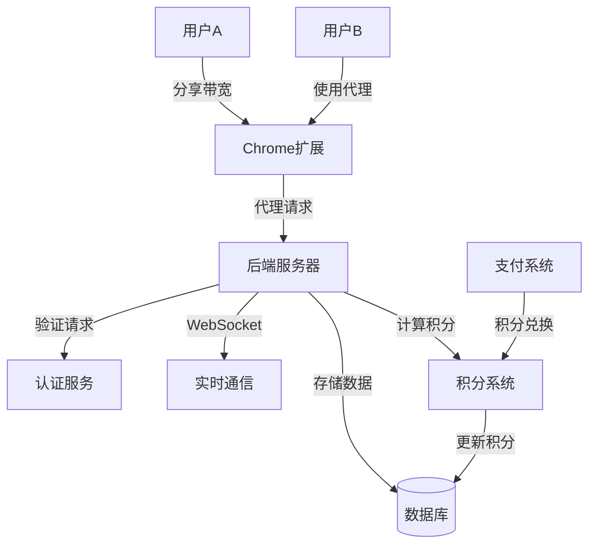
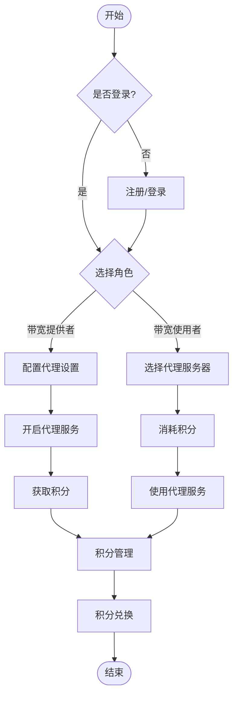

# 带宽共享代理扩展流程图

## 数据流向图

## 用户使用流程图

## 系统组件说明

1. **Chrome扩展端**
   - 提供用户界面
   - 管理代理配置
   - 处理用户认证
   - 监控流量使用

2. **后端服务器**
   - 处理代理请求
   - 用户认证和授权
   - 积分计算和管理
   - 实时通信管理

3. **数据库**
   - 存储用户信息
   - 记录流量数据
   - 管理积分账户
   - 追踪交易历史

4. **积分系统**
   - 流量转换积分
   - 积分交易
   - 推荐奖励
   - 积分兑换

## 主要功能流程

1. **带宽共享流程**
   - 用户注册/登录
   - 配置代理设置
   - 开启带宽共享
   - 获取积分奖励

2. **带宽使用流程**
   - 用户注册/登录
   - 选择可用代理
   - 消耗积分
   - 使用代理服务

3. **积分管理流程**
   - 查看积分余额
   - 积分交易
   - 积分兑换
   - 推荐奖励
