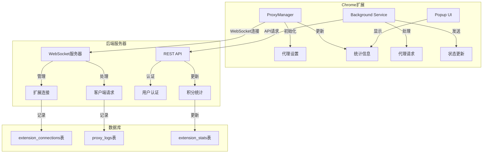

# IP代理数据流向图

## 系统架构图



## 数据表结构

### 1. extension_connections表
```sql
CREATE TABLE extension_connections (
    id SERIAL PRIMARY KEY,
    extension_id UUID NOT NULL,
    ip_address VARCHAR(45) NOT NULL,
    connected_at TIMESTAMP NOT NULL,
    disconnected_at TIMESTAMP,
    duration INTEGER,
    created_at TIMESTAMP DEFAULT CURRENT_TIMESTAMP
);
```

### 2. proxy_logs表
```sql
CREATE TABLE proxy_logs (
    id SERIAL PRIMARY KEY,
    extension_id UUID NOT NULL,
    request_url TEXT NOT NULL,
    request_method VARCHAR(10) NOT NULL,
    response_status INTEGER,
    bytes_transferred INTEGER,
    duration INTEGER,
    created_at TIMESTAMP DEFAULT CURRENT_TIMESTAMP
);
```

### 3. extension_stats表
```sql
CREATE TABLE extension_stats (
    id SERIAL PRIMARY KEY,
    extension_id UUID NOT NULL,
    bandwidth_used BIGINT DEFAULT 0,
    proxy_requests INTEGER DEFAULT 0,
    updated_at TIMESTAMP DEFAULT CURRENT_TIMESTAMP
);
```

## 数据流向说明

1. **代理请求流程**
   - Chrome扩展接收代理请求
   - ProxyManager处理请求并转发
   - 记录请求信息到proxy_logs表
   - 更新统计信息到extension_stats表

2. **连接管理流程**
   - 扩展通过WebSocket连接到服务器
   - 服务器生成唯一extension_id
   - 记录连接信息到extension_connections表
   - 定期发送心跳包保持连接

3. **统计更新流程**
   - 实时记录带宽使用情况
   - 统计代理请求次数
   - 计算在线时长
   - 更新extension_stats表

4. **数据同步流程**
   - 扩展定期向服务器发送统计信息
   - 服务器更新数据库记录
   - Popup UI从服务器获取最新数据
   - 显示实时统计信息

## 关键代码组件

1. **ProxyManager类**
   - 初始化代理设置
   - 处理代理请求
   - 管理活动连接
   - 更新统计信息

2. **WebSocket服务器**
   - 处理客户端连接
   - 管理在线状态
   - 转发代理请求
   - 同步统计数据

3. **数据库操作类**
   - 记录连接信息
   - 更新统计数据
   - 记录代理日志
   - 查询统计信息
